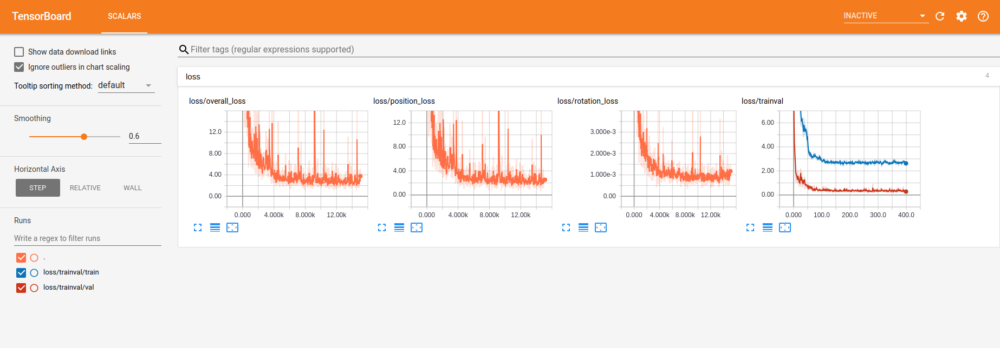

# PoseNet-Pytorch
This is the implementation of [PoseNet](https://www.cv-foundation.org/openaccess/content_iccv_2015/papers/Kendall_PoseNet_A_Convolutional_ICCV_2015_paper.pdf), [Bayesian PoseNet](https://arxiv.org/abs/1509.05909), [PoseNet with Geometric Loss](https://arxiv.org/abs/1704.00390). For PoseNet with Geometric Loss, we only implemented homoscedastic uncertainty based automatic weight scaling on loss function. We selected ResNet34 as base architecture, and it resulted in the better performance than the original papers. The code is inspired by [DejavuGAN](https://github.com/youngguncho/DejavuGAN) and [MapNet](https://github.com/samarth-robo/MapNet).

## TODO
- [x] Minimal implementation of PoseNet
- [x] Minimal implementation of Bayesian PoseNet
- [x] Minimal implementation of PoseNet with Geometric loss
- [ ] Complete Readme
- [ ] Automatic save and load the configuration
- [ ] Visualization of Saliency


## Prerequisites (Tested environment)
- Ubuntu 16.04
- Python 3.5
- Pytorch 0.4.x
- Tensorboard (optional for visualization)
- TensorboardX (optional for visualization)

## Data
The dataset loader is based on dataset of original PoseNet. Please download on of the dataset in [PoseNet Dataset](http://mi.eng.cam.ac.uk/projects/relocalisation/). Also, you can use other datasets your own. Or, you can download by running the following script (KingsCollege Dataset from PoseNet).

```
wget https://www.repository.cam.ac.uk/bitstream/handle/1810/251342/KingsCollege.zip?sequence=4&isAllowed=y
```


## Training
- Train a model
  ```
  python3 train.py --image_path ./posenet/KingsCollege --metadata_path ./posenet/KingsCollege
  ```
  - Trained models are saved in ./models_{Last Folder name of image path} and the summaries (optional) are save in ./summaries_{Last Folder name of image path}.
  - (Optinal) To visualize the training procedure, run ```tensorboard --logdir ./summaries_{Last Folder name of image path}``` and check the URL http://localhost:6006.

- Continue training
  ```
  python3 train.py --image_path ./posenet/KingsCollege --metadata_path ./posenet/KingsCollege --pretrained_model {desired epoch}
  ```

### Optimization Scheme

- The above figure represent the example of optimziation scheme of training. The loss function is based on Adam optimizaer with rotation weigh parameter (beta) 500.
- Currently, we add homoscedastic uncertainty based automatic weight scaling used in [PoseNet with Geometric Loss](https://arxiv.org/abs/1704.00390) (Maybe not same the original paper). Thus, you can check the change of s_x and s_q on training.


## Test
- Test a model with best model from validation
  ```
  python3 test.py
  ```

- Test a model with the selected epoch
  ```
  python3 test.py --test_model {Desired Epoch}
  ```
- Test a model as Baysian Inference (Dropout Inference)
  ```
  python3 test.py --baysian True
  ```

## Related Project
- We also try to implement other learning based pose regression methods
  - [Hourglass Pose](https://github.com/youngguncho/HourglassPose-Pytorch)
